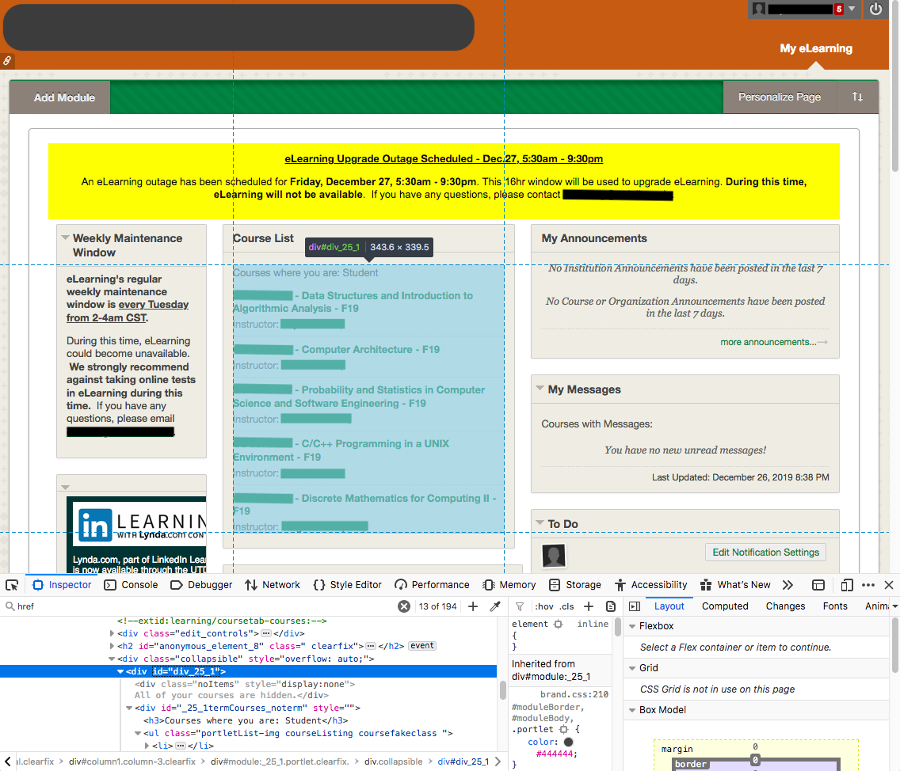

# Blackboard Duster
A scraper script for Blackboard, built with python, selenium, and the requests library. It downloads files from your courses, and sorts them neatly into folders.
**NOTE: I've graduated and don't have access to Blackboard anymore. This repo will not be updated (unless I return to school).** If something's broken, please fork the repo and make fixes there. I'm more than happy to answer questions & help where I can.

## Requirements
- Python 3
- [Selenium](https://selenium.dev/selenium/docs/api/py/index.html) for python
  ```py
  pip install selenium
  ```

- The [requests library](https://2.python-requests.org/en/master/)
  ```py
  pip install requests
  ```

- The WebDriver for your browser - make sure its version matches your browser version!
   - [Firefox WebDriver](https://github.com/mozilla/geckodriver)

      macOS users with homebrew can use `brew install geckodriver`

   - [Chrome WebDriver](https://sites.google.com/a/chromium.org/chromedriver/)

      macOS users with homebrew can use `brew cask install chromedriver`


# Usage
If you are using __Firefox__, the easiest way to get started is with
```sh
python blackboard-duster.py "www.example.edu/blackboard"
```
where `www.example.edu/blackboard` is the URL for your school's Blackboard instance. Firefox will launch and load the page. The script will wait for you to reach the homepage.

To use __Google Chrome__, use the `-w chrome` option:
```sh
python blackboard-duster.py "www.example.edu/blackboard" -w chrome
```

To use a __Chromium-based__ browser, use both `-w chrome` and `-b` with the path to your browser's executable (this feature is experimental - I haven't had much success):
```sh
python blackboard-duster.py "www.example.edu/blackboard" -w chrome -b "/Applications/Brave Browser.app/Contents/MacOS/Brave Browser"
```
No other browsers are currently supported.

## How it works
When it first runs, the script waits for the Blackboard home page to appear, so you can sign in or even navagate to Blackboard if needed. After you reach the home page, it visits each course page, downloading files. Each link is highlighted with a box to indicate how the download went:
- <b style="border:1px dotted magenta">small dotted magenta border:</b> pending download
- <b style="border:4px solid green">solid green border:</b> successful download
- <b style="border:4px solid blue">solid blue border:</b> a newer version was successfuly downloaded
- <b style="border:4px dashed cyan">dashed cyan border:</b> file was downloaded previously, and there is no newer version
- <b style="border:4px dotted red">dotted red border:</b> file collision - there is a file in the way that is not recorded in the download history. If you know this is the right file (for instance, if you downloaded it manually earlier), you can ignore this. If it bothers you, delete or move the file.

## Options
For a list of all options, use the `-h` flag.
```sh
python blackboard-duster.py -h
```
### Auto Mode
If you don't want to approve every page, use the `-a` flag.
```sh
python blackboard-duster.py "www.example.edu/blackboard" -a
```
### Save Directory
By default downloads are saved in your working directory, but the `-s <DIRECTORY PATH>` option lets you change that.
```sh
python blackboard-duster.py "www.example.edu/blackboard" -s "/Users/me/school"
```
The path is evaluated using `os.path.abspath`, so it can be absolute or relative to your working directory.
### Downloads History Location
A history of downloads will be created at `<DOWNLOAD PATH>/BlackboardDuster.json`. Future runs will use the history to check for updates and already-downloaded files. Moving, renaming, or modifying files will not affect the download history. This helps a lot if you disagree with how your professor has things organized. If you need to change where the history is saved/loaded from, use the `--historypath` option.
```sh
python blackboard-duster.py "www.example.edu/blackboard" --historypath "/Users/me/far/far/away/onion.json"
```
### Ignore Pages
If a page doesn't have a content list, the script waits a few seconds before moving on (in case the content list is just taking its sweet time loading). This can get annoying if there are several content-free pages for each class. Some are ignored by default (such as "Blackboard Collaborate" and "My Grades"); add a page to the ignore list with the `-i <NAME>` option.
```sh
python blackboard-duster.py "www.example.edu/blackboard" -i "School Email" -i "Exams"
```

# Troubleshooting
### "The script does not wait long enough for the pages to load!"
Use the `--delay <#>` option, which sets a delay multiplier. The example below will give pages twice as long as normal for pages to load.
```bash
python blackboard-duster.py "www.example.edu/blackboard" --delay 2
```

### "The cookie notice never goes away!"
This actually isn't a problem, just an irritation. The entire page is accessible to Selenium even if it can't click on anything. Because the script uses URLs to navagate, it never needs to _click_ on anything (except the cookie notice).

### "The script says there are no courses, but I can see them on the home page!"
Your course list might be using a different css tag, and you will need to change the [css selector](https://saucelabs.com/resources/articles/selenium-tips-css-selectors) in the code. The `get_courses_info()` function looks for the course list; replace every instance of `div#div_25_1` (there are 2) with your list's selector. Both [Firefox](https://developer.mozilla.org/en-US/docs/Tools/Page_Inspector) and [Chrome](https://developers.google.com/web/tools/chrome-devtools/) have built in page inspectors. Highlight __this__ element:


### "The script can't find the navpane!"
This is similar to the course list problem. The `get_navpane_info()` function handles the navpane; replace every instance of `ul#courseMenuPalette_contents` (there are 2) with your navpane's selector. Highlight __this__ element; you may need to make the page wider to see it:


### "My problem isn't on this list!"
That is a problem, isn't it! Open an issue or send me a message, and I'll get back to you as soon as I can.

# License
Copyright (C) 2020  Taylor Smith

This program is free software: you can redistribute it and/or modify
it under the terms of the GNU General Public License as published by
the Free Software Foundation, either version 3 of the License, or
(at your option) any later version.

This program is distributed in the hope that it will be useful,
but WITHOUT ANY WARRANTY; without even the implied warranty of
MERCHANTABILITY or FITNESS FOR A PARTICULAR PURPOSE.  See the
GNU General Public License for more details.

You should have received a copy of the GNU General Public License
along with this program.  If not, see https://www.gnu.org/licenses/
